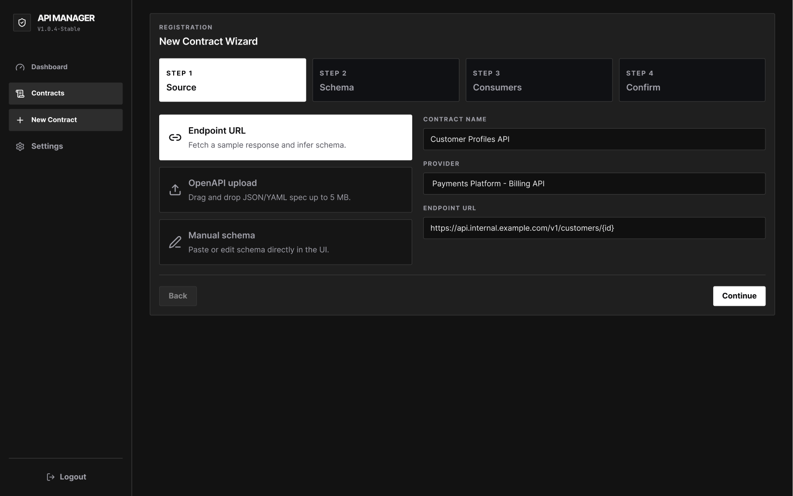
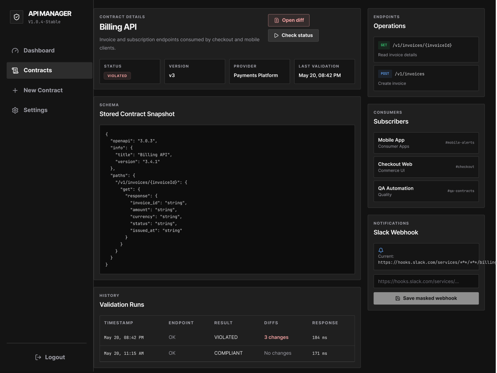
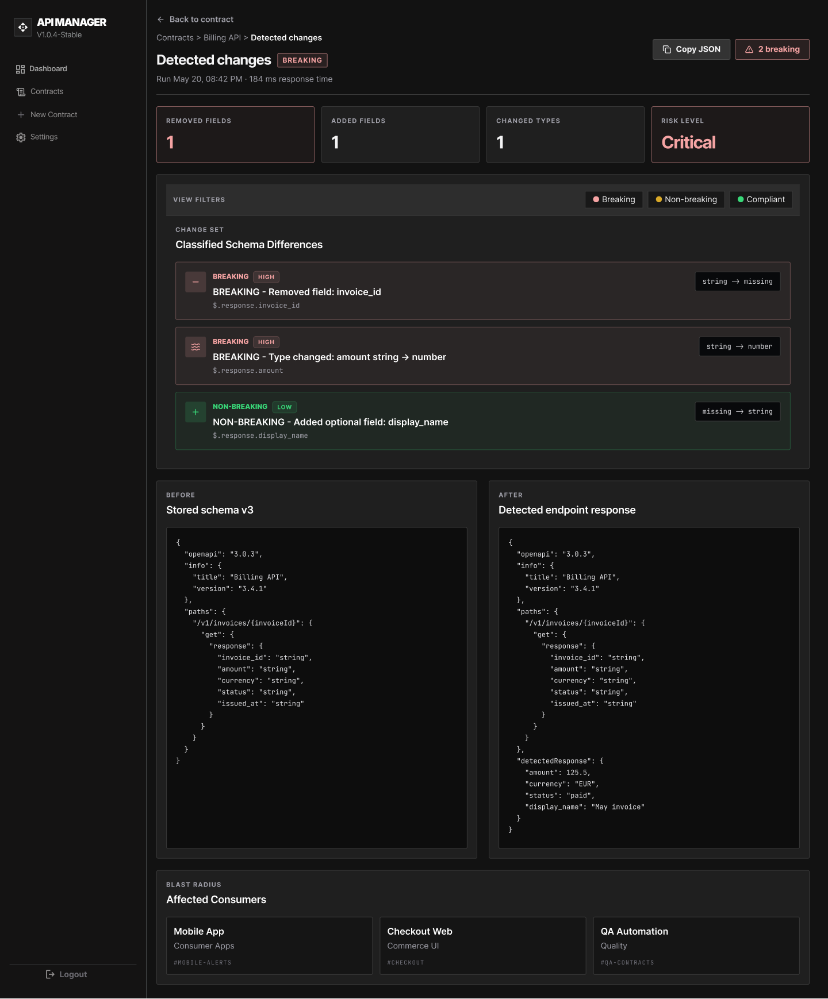
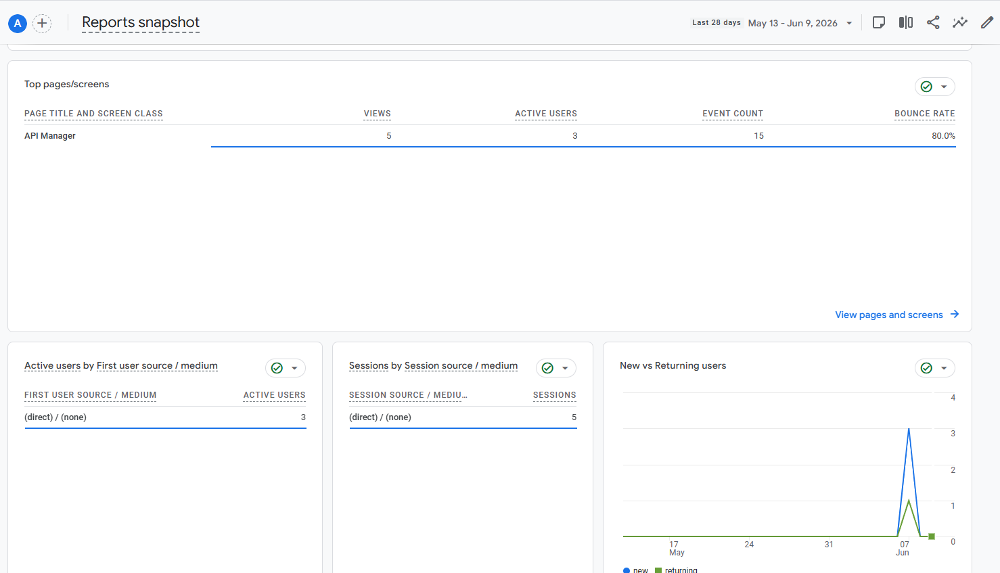
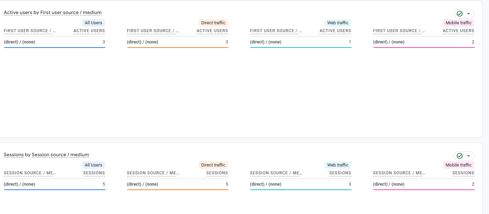
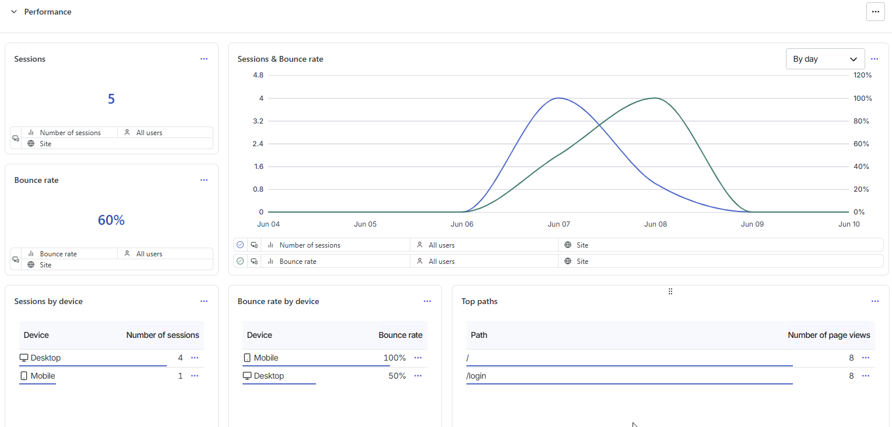
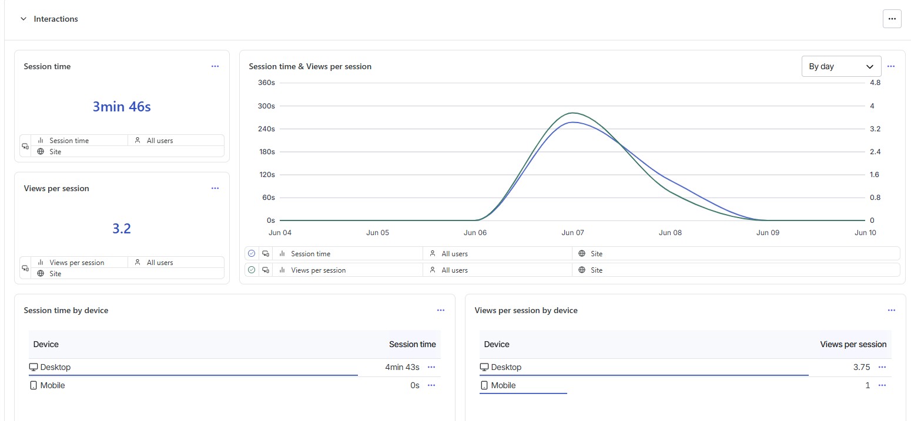

# API Manager

**Projekt witryny — przedmiot TPF**

Aplikacja webowa do zarządzania kontraktami API, monitorowania ich zgodności oraz wizualizacji breaking i non-breaking changes. 

**Repozytorium:** https://github.com/tomasz-umanski/api-manager  
**Aplikacja produkcyjna:** https://api-manager-production-0456.up.railway.app

---

## Spis treści

1. [Opis projektu](#opis-projektu)
2. [Cel i problem biznesowy](#cel-i-problem-biznesowy)
3. [Funkcjonalności](#funkcjonalności)
4. [Mapowanie na makietę (prototyp)](#mapowanie-na-makietę-prototyp)
5. [Routing aplikacji](#routing-aplikacji)
6. [Stack technologiczny](#stack-technologiczny)
7. [Struktura projektu](#struktura-projektu)
8. [Instrukcja uruchomienia](#instrukcja-uruchomienia)
9. [Konfiguracja usług zewnętrznych](#konfiguracja-usług-zewnętrznych)
10. [Deploy](#deploy)
11. [Zrzuty ekranu aplikacji](#zrzuty-ekranu-aplikacji)
12. [Google Analytics 4](#google-analytics-4)
13. [Hotjar](#hotjar)
14. [Dokumentacja dodatkowa](#dokumentacja-dodatkowa)

---

## Opis projektu

**API Manager** to panel dla zespołów developerskich, który centralizuje kontrakty API i pomaga wykrywać niezapowiedziane zmiany zanim trafią na produkcję. System umożliwia rejestrację kontraktów (URL, plik OpenAPI, formularz), ręczne uruchamianie walidacji, prezentację różnic w widoku Diff Viewer oraz konfigurację powiadomień Slack.

Szczegółowa specyfikacja funkcjonalna i wymagania biznesowe: [docs/SPECIFICATION.md](docs/SPECIFICATION.md).

---

## Cel i problem biznesowy

Zespoły pracujące z API napotykają typowe problemy:

- brak centralnego miejsca przechowywania kontraktów API,
- zmiany wprowadzane bez komunikacji między zespołami,
- wykrywanie błędów dopiero na produkcji,
- brak informacji o zależnościach między producentem a konsumentami API.

**Cel aplikacji:** zapewnienie jednego źródła prawdy dla kontraktów API oraz automatyczne wykrywanie i komunikowanie zmian (breaking / non-breaking).

Pełny opis problemu i rozwiązania: [docs/SUMMARY.md](docs/SUMMARY.md).

---

## Funkcjonalności

### Autoryzacja

| Funkcja | Opis |
|---------|------|
| Logowanie Email/Password | Firebase Authentication z formularzem logowania |
| Rejestracja konta | Przycisk „Register new account” na ekranie logowania |
| Wylogowanie | Dostępne z menu bocznego po zalogowaniu |
| Chronione trasy | Dostęp do panelu wymaga zalogowania; przekierowanie na `/login` |

### Dashboard (`/`)

- Podsumowanie statusu kontraktów (zgodne / naruszone / nieznane)
- Lista ostatnich naruszeń i log aktywności
- Szybki dostęp do kontraktów wymagających uwagi

### Rejestr kontraktów

- **Lista kontraktów** (`/contracts`) — wyszukiwanie, filtrowanie po statusie, walidacja ręczna
- **Nowy kontrakt** (`/contracts/new`) — kreator wieloetapowy:
  - import z URL endpointu,
  - import pliku OpenAPI (JSON/YAML),
  - formularz ręczny,
  - przypisanie konsumentów
- **Szczegóły kontraktu** (`/contracts/:contractId`) — schemat, historia walidacji, konfiguracja webhooka Slack

### Walidacja i Diff Viewer

- Ręczne uruchomienie sprawdzenia zgodności („Sprawdź status”)
- Automatyczne przejście do Diff Viewera po wykryciu naruszenia
- Widok przed/po z oznaczeniem zmian **BREAKING** (czerwony) i **NON-BREAKING** (żółty/zielony)
- Trasa: `/diff/:contractId/:runId`

### Ustawienia workspace (`/settings`)

- Konfiguracja profilu i preferencji workspace

### Analityka i monitoring użytkowników

- **Google Analytics 4** — śledzenie pageview przy każdej zmianie trasy SPA (`AnalyticsListener`)
- **Hotjar** — nagrania sesji, heatmapy; ręczne `Hotjar.stateChange()` przy nawigacji React Router

---

## Mapowanie na makietę (prototyp)

Makiety projektowe znajdują się w folderze [docs/prototypes/](docs/prototypes/). Poniższa tabela pokazuje zgodność ekranów z prototypem Figma:

| Ekran w makiecie | Trasa w aplikacji | Plik strony |
|------------------|-------------------|-------------|
| Auth (Logowanie) | `/login` | `src/pages/AuthPage.tsx` |
| Dashboard | `/` | `src/pages/DashboardPage.tsx` |
| Contracts (Lista) | `/contracts` | `src/pages/ContractsPage.tsx` |
| New Contract (Kreator) | `/contracts/new` | `src/pages/NewContractPage.tsx` |
| Contract Details | `/contracts/:contractId` | `src/pages/ContractDetailsPage.tsx` |
| Diff Viewer | `/diff/:contractId/:runId` | `src/pages/DiffViewerPage.tsx` |
| Settings (Profil/Ustawienia) | `/settings` | `src/pages/SettingsPage.tsx` |
| 404 (fallback) | `*` | `src/pages/NotFoundPage.tsx` |

Wspólny layout (sidebar, nawigacja) realizuje komponent `AppShell` z zagnieżdżonym routingiem.

---

## Routing aplikacji

Aplikacja korzysta z **React Router** (`BrowserRouter` w `src/main.tsx`). Nawigacja odbywa się bez przeładowania strony (SPA).

| Trasa | Dostęp | Opis |
|-------|--------|------|
| `/login` | Publiczny | Logowanie i rejestracja |
| `/` | Chroniony | Dashboard |
| `/contracts` | Chroniony | Lista kontraktów |
| `/contracts/new` | Chroniony | Kreator nowego kontraktu |
| `/contracts/:contractId` | Chroniony | Szczegóły kontraktu |
| `/diff/:contractId/:runId` | Chroniony | Diff Viewer |
| `/settings` | Chroniony | Ustawienia workspace |
| `*` | Publiczny | Strona 404 |

Chronione trasy opakowane są w `ProtectedRoute` — niezalogowany użytkownik jest przekierowywany na `/login`.

---

## Stack technologiczny

| Warstwa | Technologia |
|---------|-------------|
| Framework UI | React 19 + TypeScript |
| Bundler | Vite |
| Stylowanie | Tailwind CSS |
| Routing | React Router |
| Autoryzacja | Firebase Authentication |
| Analityka | react-ga4 (Google Analytics 4) |
| Zachowania użytkowników | @hotjar/browser |
| Testy | Vitest + Testing Library |
| Deploy | Railway + `serve` (SPA mode) |

---

## Struktura projektu

```text
src/
  pages/                    Widoki aplikacji (jeden plik = jeden ekran)
    AuthPage.tsx
    DashboardPage.tsx
    ContractsPage.tsx
    NewContractPage.tsx
    ContractDetailsPage.tsx
    DiffViewerPage.tsx
    SettingsPage.tsx
    NotFoundPage.tsx
  components/
    layout/                 AppShell, ProtectedRoute
    ui/                     Reużywalne komponenty (Button, TextInput, Badge, Card…)
    AnalyticsListener.tsx   Śledzenie pageview GA4 + Hotjar stateChange
  services/                 Auth, mock API
  store/                    Stan aplikacji
  lib/                      Konfiguracja Firebase
docs/
  prototypes/               Makiety Figma (PNG)
  screenshots/              Zrzuty ekranu do dokumentacji
  SPECIFICATION.md          Pełna specyfikacja funkcjonalna
  SETUP.md                  Instrukcja konfiguracji krok po kroku
  SUMMARY.md                Opis problemu i rozwiązania
```

**Reużywalne komponenty UI** (`src/components/ui/`): `Button`, `TextInput`, `TextArea`, `SelectInput`, `Badge`, `Card`, `StatusBadge`, `RiskBadge`, `PageHeader` — wszystkie przyjmują props i są używane w wielu widokach.

---

## Instrukcja uruchomienia

### Wymagania

- Node.js **22.x** (patrz `.nvmrc` i `engines` w `package.json`)
- npm

### Kroki

```bash
# 1. Sklonuj repozytorium i przejdź do katalogu projektu
git clone <url-repozytorium>
cd api-manager

# 2. Zainstaluj zależności
npm install

# 3. Utwórz plik środowiskowy
cp .env.example .env
```

Uzupełnij `.env` danymi z Firebase Console, Google Analytics i Hotjar (szczegóły w sekcji [Konfiguracja usług zewnętrznych](#konfiguracja-usług-zewnętrznych) oraz [docs/SETUP.md](docs/SETUP.md)).

```bash
# 4. Uruchom serwer deweloperski
npm run dev
```

Aplikacja domyślnie dostępna pod adresem: **http://localhost:5173/**

> **Tryb deweloperski bez Firebase:** gdy `VITE_FIREBASE_API_KEY` nie jest ustawione, aplikacja uruchamia mockowe logowanie (dowolny email/hasło). Do oddania projektu i wdrożenia produkcyjnego **wymagana** jest pełna konfiguracja Firebase.

### Pozostałe skrypty

| Skrypt | Opis |
|--------|------|
| `npm run dev` | Serwer deweloperski Vite |
| `npm run build` | Build produkcyjny (TypeScript + Vite) |
| `npm run start` | Serwowanie folderu `dist/` (deploy) |
| `npm run preview:prod` | Build + start lokalnie (symulacja produkcji) |
| `npm test` | Testy jednostkowe (Vitest) |
| `npm run lint` | ESLint |

---

## Konfiguracja usług zewnętrznych

### Firebase Authentication

1. Utwórz projekt w [Firebase Console](https://console.firebase.google.com/).
2. Dodaj aplikację webową i skopiuj konfigurację do `.env`.
3. Włącz metodę logowania **Email/Password** (Authentication → Sign-in method).
4. Utwórz użytkownika testowego w konsoli lub przez „Register new account” w aplikacji.
5. Po deployu dodaj domenę Railway w **Authorized domains**.

```env
VITE_FIREBASE_API_KEY=
VITE_FIREBASE_AUTH_DOMAIN=
VITE_FIREBASE_PROJECT_ID=
VITE_FIREBASE_STORAGE_BUCKET=
VITE_FIREBASE_MESSAGING_SENDER_ID=
VITE_FIREBASE_APP_ID=
```

Implementacja: `src/lib/firebase.ts`, `src/services/authService.ts`, `src/components/layout/ProtectedRoute.tsx`.

### Google Analytics 4

Pakiet: `react-ga4`. Inicjalizacja w `src/App.tsx`, listener pageview w `src/components/AnalyticsListener.tsx`.

```env
VITE_GA_MEASUREMENT_ID=G-XXXXXXXXXX
```

Przy każdej zmianie trasy React Router wysyłany jest event `pageview` — wymagane dla aplikacji SPA.

### Hotjar

Pakiet: `@hotjar/browser`. Inicjalizacja w `src/App.tsx`, `Hotjar.stateChange()` przy nawigacji w `AnalyticsListener`.

```env
VITE_HOTJAR_SITE_ID=1234567
VITE_HOTJAR_VERSION=6
```

W panelu Hotjar ustaw **Track changes manually** (aplikacja to SPA).

> **Pełna instrukcja krok po kroku:** [docs/SETUP.md](docs/SETUP.md)

---

## Deploy

Projekt wdrożony na **[Railway](https://railway.com/)** z konfiguracją w `railway.json`:

- **Build:** `npm run build`
- **Start:** `npm run start` (serwowanie `dist/` przez `serve -s`, tryb SPA)

### Kroki wdrożenia

1. Połącz repozytorium z Railway (Deploy from GitHub repo).
2. Ustaw **wszystkie** zmienne `VITE_*` z `.env.example` w Railway Variables.
3. Wygeneruj publiczną domenę (Settings → Networking → Generate Domain).
4. Dodaj domenę Railway w Firebase Authorized domains.
5. Zaktualizuj URL w Google Analytics i Hotjar.
6. Po każdej zmianie zmiennych uruchom **Redeploy** (Vite wstawia `VITE_*` w czasie buildu).

**URL produkcyjny:** https://api-manager-production-0456.up.railway.app

Lokalna symulacja produkcji:

```bash
npm run preview:prod
```

---

## Zrzuty ekranu aplikacji

### Logowanie (`/login`)


### Dashboard (`/`)


### Lista kontraktów (`/contracts`)


### Nowy kontrakt (`/contracts/new`)



### Szczegóły kontraktu (`/contracts/:contractId`)



### Diff Viewer (`/diff/:contractId/:runId`)



### Ustawienia (`/settings`)


---

## Google Analytics 4

Po wdrożeniu i skonfigurowaniu `VITE_GA_MEASUREMENT_ID` w panelu GA4 widoczne są pageview ze wszystkich tras React Router (np. `/`, `/login`, `/contracts`, `/contracts/new`, `/contracts/:contractId`, `/diff/:contractId/:runId`, `/settings`).

### Raport





**Panel GA4:** [Google Analytics](https://analytics.google.com/analytics/web/#/a397019903p540469431/reports/intelligenthome?params=_u..nav%3Dmaui)

---

## Hotjar

Po ustawieniu `VITE_HOTJAR_SITE_ID` Hotjar rejestruje zachowania użytkowników na ekranach aplikacji (nagrania sesji, heatmapy).

### Panel Hotjar





**Panel Hotjar:** [Contentsquare / Hotjar](https://app.contentsquare.com/#/dashboards/e7fb570b-0a7b-40eb-b73c-cbd86263ba3e?project=864856&hash=73ae162bf9724b4c194e2e09b3b76107)

---

## Dokumentacja dodatkowa

| Plik | Zawartość |
|------|-----------|
| [docs/SPECIFICATION.md](docs/SPECIFICATION.md) | Pełna specyfikacja funkcjonalna, wymagania MoSCoW, model danych |
| [docs/SUMMARY.md](docs/SUMMARY.md) | Opis problemu, rozwiązania i wartości biznesowej |
| [docs/SETUP.md](docs/SETUP.md) | Szczegółowa instrukcja konfiguracji Firebase, GA4, Hotjar, Railway |
| [docs/DOMAIN.md](docs/DOMAIN.md) | Słownik pojęć domenowych |
| [docs/prototypes/](docs/prototypes/) | Makiety ekranów (PNG) |

---

## Linki

| Zasób | URL |
|-------|-----|
| Aplikacja (produkcja) | https://api-manager-production-0456.up.railway.app |
| Deploy (Railway) | https://railway.com/project/6b4e6728-1e26-46b7-b0bf-dfbadd5771dc/service/c3c7772e-eed1-4ed5-a0b4-f2eefb4b4dee/variables?environmentId=e79de073-4a90-44dc-8e75-9357d9d861a2 |
| Google Analytics | https://analytics.google.com/analytics/web/#/a397019903p540469431/reports/intelligenthome?params=_u..nav%3Dmaui |
| Hotjar | https://app.contentsquare.com/#/dashboards/e7fb570b-0a7b-40eb-b73c-cbd86263ba3e?project=864856&hash=73ae162bf9724b4c194e2e09b3b76107 |
