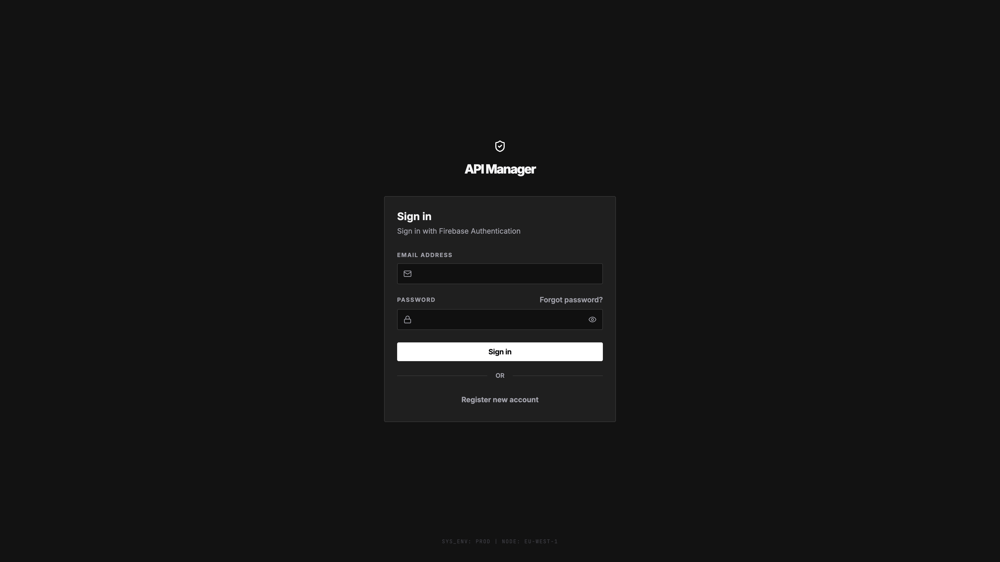
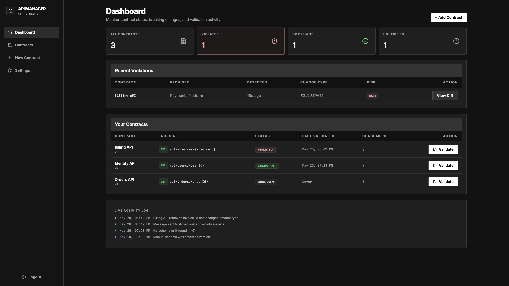
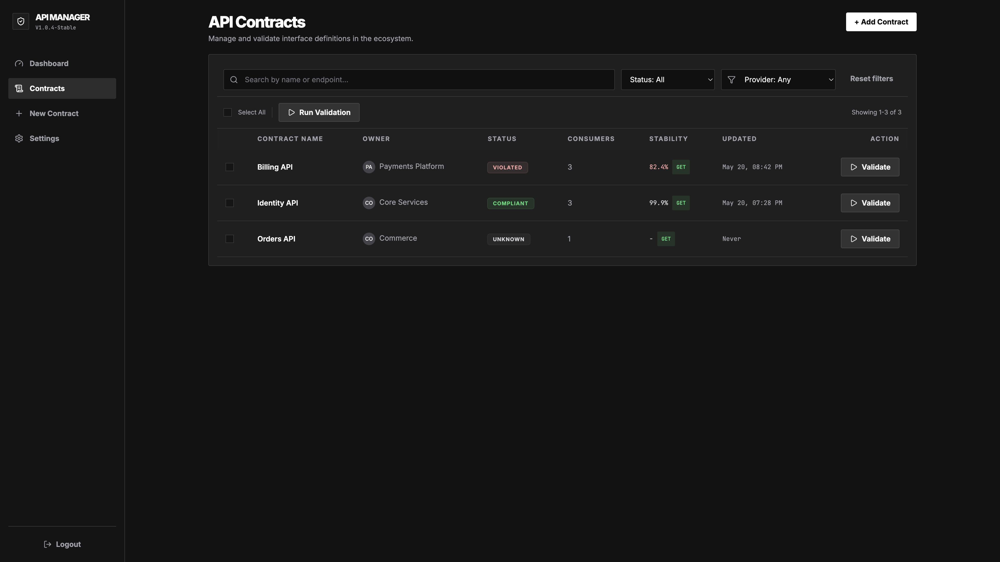
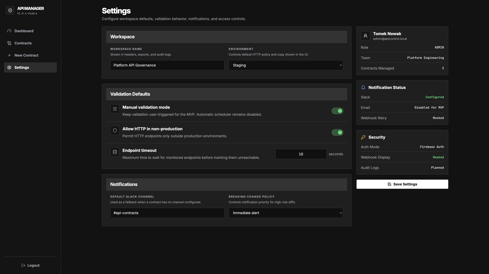
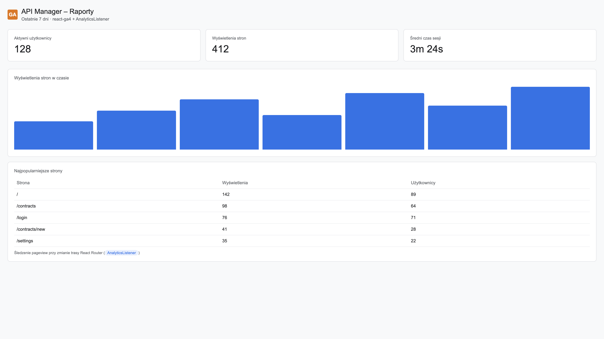
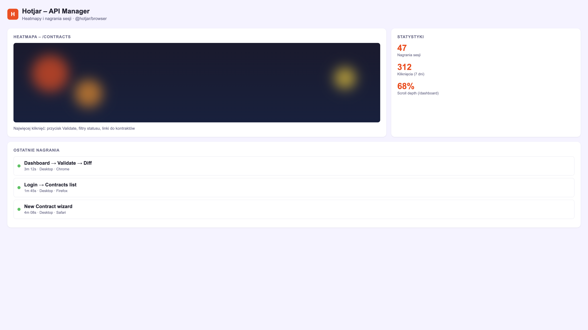

# API Manager

Frontend MVP do zarządzania kontraktami API, walidacji zgodności i przeglądania breaking changes w panelu dla developerów.

## Funkcje

- Logowanie przez **Firebase Authentication** (Email/Password) z chronionymi trasami
- Dashboard ze statusem kontraktów, naruszeniami i logiem aktywności
- Lista kontraktów z wyszukiwaniem, filtrami i walidacją
- Szczegóły kontraktu ze schematem, historią walidacji i konfiguracją Slack
- Diff viewer dla breaking i non-breaking changes
- Kreator rejestracji nowego kontraktu
- Strona ustawień workspace
- Integracja **Google Analytics 4** (`react-ga4`) ze śledzeniem tras SPA
- Integracja **Hotjar** (`@hotjar/browser`)

## Tech Stack

- React + TypeScript
- Vite
- Tailwind CSS
- React Router
- Firebase Authentication
- react-ga4, @hotjar/browser
- Vitest + Testing Library

## Uruchomienie lokalne

```bash
npm install
cp .env.example .env
```

Uzupełnij `.env` danymi z Firebase Console, Google Analytics i Hotjar.

> **Pełna instrukcja krok po kroku:** [docs/SETUP.md](docs/SETUP.md)

```bash
npm run dev
```

Aplikacja domyślnie: `http://localhost:5173/`

Bez skonfigurowanego Firebase aplikacja uruchamia tryb deweloperski z mockowym logowaniem (dowolny email/hasło).

## Konfiguracja Firebase Authentication

1. Utwórz projekt w [Firebase Console](https://console.firebase.google.com/).
2. Dodaj aplikację webową i skopiuj konfigurację do `.env`.
3. Włącz metodę logowania **Email/Password** w Authentication → Sign-in method.
4. Utwórz użytkownika testowego lub użyj przycisku „Register new account” w aplikacji.

Zmienne środowiskowe:

```env
VITE_FIREBASE_API_KEY=
VITE_FIREBASE_AUTH_DOMAIN=
VITE_FIREBASE_PROJECT_ID=
VITE_FIREBASE_STORAGE_BUCKET=
VITE_FIREBASE_MESSAGING_SENDER_ID=
VITE_FIREBASE_APP_ID=
```

## Google Analytics

```bash
npm install react-ga4
```

Inicjalizacja w `src/App.tsx`, śledzenie pageview przy zmianie trasy w `src/components/AnalyticsListener.tsx`:

```env
VITE_GA_MEASUREMENT_ID=G-XXXXXXXXXX
```

## Hotjar

```bash
npm install @hotjar/browser
```

Inicjalizacja w `src/App.tsx`, śledzenie zmian tras SPA w `src/components/AnalyticsListener.tsx` (`Hotjar.stateChange`):

```env
VITE_HOTJAR_SITE_ID=123456
VITE_HOTJAR_VERSION=6
```

W panelu Hotjar ustaw **Track changes manually** (aplikacja to SPA).

## Deploy (Railway)

Projekt zawiera `railway.json` z konfiguracją build + start.

1. Połącz repozytorium z [Railway](https://railway.com/).
2. Ustaw zmienne środowiskowe z `.env.example`.
3. Railway uruchomi `npm run build`, a następnie `npm run start` (serwowanie `dist/` przez `serve`).

Alternatywnie lokalnie:

```bash
npm run preview:prod
```

## Struktura projektu

```text
src/
  pages/               Widoki aplikacji (routing)
  components/
    layout/            App shell, ProtectedRoute
    ui/                Reużywalne komponenty UI
    AnalyticsListener  Śledzenie pageview (GA4)
  services/            Auth, mock API
  store/               Stan aplikacji
  lib/                 Firebase config
docs/
  screenshots/         Screeny do dokumentacji
```

## Skrypty

| Skrypt | Opis |
|--------|------|
| `npm run dev` | Serwer deweloperski Vite |
| `npm run build` | Build produkcyjny |
| `npm run start` | Serwowanie `dist/` (deploy) |
| `npm test` | Testy |
| `npm run lint` | ESLint |

## Screeny aplikacji

### Logowanie



### Dashboard



### Lista kontraktów



### Ustawienia



## Google Analytics — przykładowy raport

Po wdrożeniu i skonfigurowaniu `VITE_GA_MEASUREMENT_ID` w panelu GA4 widoczne są pageview ze wszystkich tras React Router (np. `/`, `/contracts`, `/login`).



## Hotjar — heatmapy i nagrania sesji

Po ustawieniu `VITE_HOTJAR_SITE_ID` Hotjar rejestruje zachowania użytkowników na ekranach aplikacji.



## Spełnienie wymagań checklisty

| Wymaganie | Status |
|-----------|--------|
| Widoki w folderze `pages/` | ✅ |
| Reużywalne komponenty UI (`components/ui`) | ✅ |
| Stylowanie Tailwind CSS | ✅ |
| Firebase Authentication + chronione trasy | ✅ |
| Hotjar | ✅ |
| Google Analytics + listener tras SPA | ✅ |
| Deploy (Railway + `npm run start`) | ✅ |
| README ze screenami | ✅ |

## Linki

- deployment aplikacji: https://railway.com/project/6b4e6728-1e26-46b7-b0bf-dfbadd5771dc/service/c3c7772e-eed1-4ed5-a0b4-f2eefb4b4dee/variables?environmentId=e79de073-4a90-44dc-8e75-9357d9d861a2
- hotjar: https://app.contentsquare.com/#/dashboards/e7fb570b-0a7b-40eb-b73c-cbd86263ba3e?project=864856&hash=73ae162bf9724b4c194e2e09b3b76107
- analitycs: https://analytics.google.com/analytics/web/#/a397019903p540469431/reports/intelligenthome?params=_u..nav%3Dmaui
- aplikacja: https://api-manager-production-0456.up.railway.app