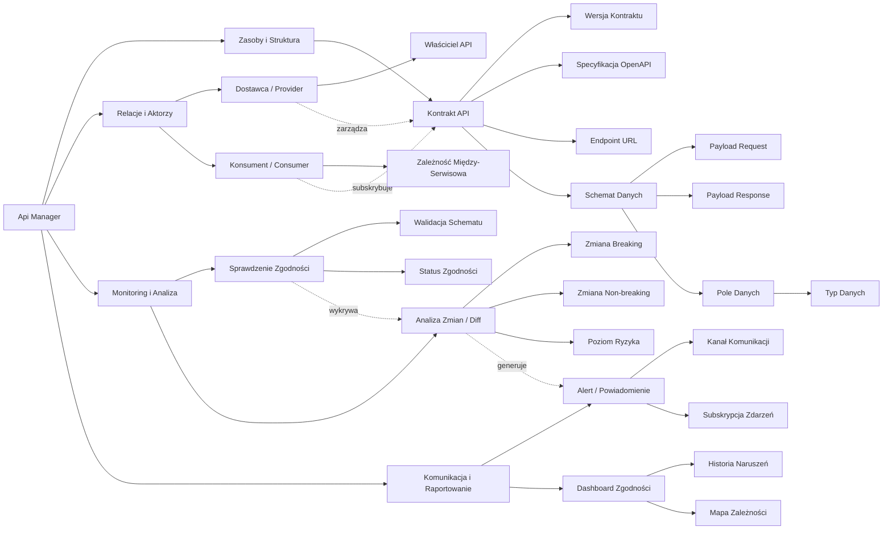

## 1. Wizualizacja Graficzna (Mermaid)

Fragment kodu

---

## 2. Słownik Pojęć

### 2.1 Zasoby i Struktura

| **Termin** | **Definicja Biznesowa** |
| --- | --- |
| **Kontrakt API** | Centralna definicja porozumienia między systemami, określająca jak dane mają być przesyłane. |
| **Wersja Kontraktu** | Konkretna iteracja kontraktu w czasie, pozwalająca na śledzenie ewolucji API. |
| **Schemat Danych** | Techniczna struktura wiadomości (JSON/XML), definiująca oczekiwane pola i ich formaty. |
| **Pole Danych** | Najmniejsza jednostka informacji w payloadzie (np. `user_id`). |

### 2.2 Relacje i Aktorzy

| **Termin** | **Definicja Biznesowa** |
| --- | --- |
| **Dostawca (Provider)** | Zespół lub system odpowiedzialny za utrzymanie i udostępnianie API. |
| **Konsument (Consumer)** | System lub zespół, który polega na danych z API i jest podatny na jego zmiany. |
| **Zależność Między-Serwisowa** | Formalne powiązanie wskazujące, który Konsument korzysta z którego Kontraktu. |

### 2.3 Monitoring i Analiza

| **Termin** | **Definicja Biznesowa** |
| --- | --- |
| **Sprawdzenie Zgodności** | Akcja weryfikacji, czy rzeczywista odpowiedź z endpointu zgadza się z zapisanym Kontraktem. |
| **Zmiana Breaking** | Zmiana w API, która uniemożliwia poprawne działanie istniejących Konsumentów (np. usunięcie pola). |
| **Poziom Ryzyka** | Ocena wpływu wykrytej zmiany na stabilność ekosystemu. |

### 2.4 Komunikacja i Raportowanie

| **Termin** | **Definicja Biznesowa** |
| --- | --- |
| **Subskrypcja Zdarzeń** | Mechanizm zapisania się Konsumenta na powiadomienia o zmianach w danym Kontrakcie. |
| **Mapa Zależności** | Wizualizacja powiązań w całej architekturze, pokazująca "efekt domina" przy zmianach. |

---

## 3. Kluczowe Reguły Biznesowe

1. **Własność:** Każdy Kontrakt musi posiadać dokładnie jednego przypisanego Właściciela (Providera).
2. **Nienaruszalność Wersji:** Raz opublikowana Wersja Kontraktu nie może być edytowana (wymagana nowa wersja lub analiza Diff).
3. **Prymat Konsumenta:** Każda zmiana typu *Breaking* musi wygenerować alert do wszystkich subskrybowanych Konsumentów.

---

*Ostatnia aktualizacja: 2026-04-15*