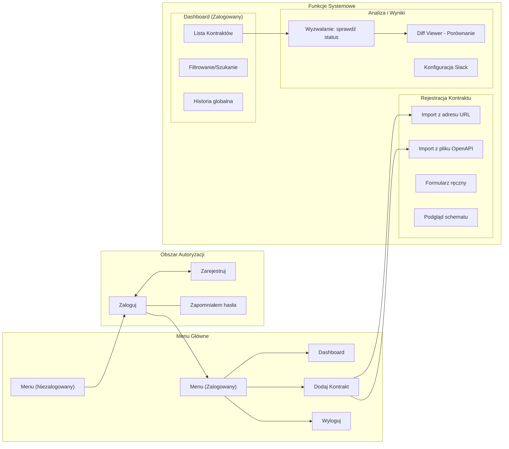

## 1. Kontekst i cele

- **Cel biznesowy:** Eliminacja awarii produkcyjnych wynikających z niezapowiedzianych zmian w API poprzez zapewnienie "Single Source of Truth" oraz automatyczną analizę zgodności kontraktów.
- **Interesariusze:** Zespoły Backend (Producenci), Zespoły Frontend/Mobile/QA (Konsumenci), Architekci systemowi.
- **KPI:**
    - Redukcja liczby incydentów produkcyjnych spowodowanych zmianami w API o 40% w ciągu pierwszych 6 miesięcy.
    - Czas wykrycia *breaking change* od momentu wystąpienia: poniżej 15 minut (w modelu z aktywnym monitoringiem).
    - Wskaźnik adopcji narzędzia: 80% projektów wewnątrz organizacji zarejestrowanych w systemie w ciągu roku.

## 2. Zakres projektu

- **In-scope (MVP):** Rejestracja API (URL/OpenAPI), manualne wyzwalanie testów, wizualizacja różnic (Diff), integracja ze Slackiem, prosty dashboard.
- **Out-of-scope (MVP):** Automatyczny scheduler, integracja z CI/CD, zaawansowana grafowa mapa zależności, pełne wsparcie GraphQL.
- **Założenia i ograniczenia:** System zakłada dostępność endpointów przez HTTP/HTTPS. MVP ogranicza się do walidacji strukturalnej (JSON) oraz typów danych.

## 3. Użytkownicy i persony

- **Backend Lead (Producent):** Potrzebuje szybko sprawdzić, czy jego zmiana wprowadza regresję.
    - *User Story:* "Jako Backend Lead chcę szybko sprawdzić wpływ moich zmian w kodzie na kontrakt, abym mógł bezpiecznie wypchnąć zmiany na produkcję."
- **Frontend Dev (Konsument):** Potrzebuje być powiadomiony, zanim jego UI przestanie działać.
    - *User Story:* "Jako Frontend Dev chcę otrzymywać natychmiastowe powiadomienie na Slacku o zmianie kontraktu, aby móc dostosować kod przed wystąpieniem błędu."

---

## 4. Wymagania funkcjonalne

### 4.1 Metodologia priorytetyzacji

Każde wymaganie oznaczone jest priorytetem zgodnie z metodą MoSCoW:

- **[M] Must have** — wymaganie krytyczne dla działania MVP, brak wyklucza odbiór produktu
- **[S] Should have** — wymagane w pierwszym wydaniu po MVP, silnie oczekiwane przez użytkowników
- **[C] Could have** — pożądane rozszerzenie, realizowane jeśli pozwala na to budżet/czas
- **[W] Won't have (now)** — świadomie odroczone poza aktualny horyzont projektu

---

### 4.2 Moduł rejestracji kontraktów API

Moduł umożliwia dodanie nowego kontraktu do systemu i stanowi punkt wejścia dla wszystkich kolejnych operacji monitoringu.

| ID | Wymaganie | Priorytet | Źródło |
| --- | --- | --- | --- |
| F-REG-01 | System umożliwia rejestrację kontraktu poprzez podanie URL endpointu HTTP/HTTPS | [M] | Ankieta 49% + wywiad |
| F-REG-02 | System umożliwia rejestrację kontraktu poprzez import pliku w formacie OpenAPI (JSON lub YAML) | [M] | Ankieta 49% — dominująca preferencja |
| F-REG-03 | System umożliwia rejestrację kontraktu poprzez ręczne wypełnienie formularza w UI (ścieżka awaryjna) | [S] | Ankieta 9% — fallback |
| F-REG-04 | Każdy kontrakt musi mieć przypisanego dokładnie jednego właściciela (Provider) w momencie rejestracji | [M] | Reguła biznesowa #1 |
| F-REG-05 | System waliduje poprawność składniową wgrywanego pliku OpenAPI/JSON Schema i informuje o błędach przed zapisem | [M] | Jakość danych / UX |
| F-REG-06 | Podczas rejestracji użytkownik może przypisać dowolną liczbę konsumentów (Consumers) do kontraktu | [S] | Wywiad — transparentność zależności |
| F-REG-07 | Rejestracja kontraktu metodą importu pliku obsługuje interfejs Drag & Drop | [S] | Rekomendacja UX z badań |
| F-REG-08 | System obsługuje import kontraktu z repozytorium GitHub/GitLab poprzez podanie URL do surowego pliku | [W] | Ankieta 7% — po MVP |

**Kryteria akceptacji dla F-REG-01:** Użytkownik podaje URL endpointu. System wykonuje żądanie GET, pobiera nagłówki i body odpowiedzi, a następnie prezentuje propozycję wygenerowanego schematu do zatwierdzenia przez użytkownika przed ostatecznym zapisem.

**Kryteria akceptacji dla F-REG-02:** Użytkownik wgrywa plik `.json` lub `.yaml`. System parsuje plik, wyświetla podgląd wykrytych endpointów i schematów. Użytkownik potwierdza zapis. W przypadku błędu składni system wyświetla komunikat ze wskazaniem linii lub pola powodującego błąd.

---

### 4.3 Moduł manualnego wyzwalania walidacji

W zakresie MVP walidacja uruchamiana jest wyłącznie na żądanie użytkownika (brak automatycznego harmonogramu).

| ID | Wymaganie | Priorytet | Źródło |
| --- | --- | --- | --- |
| F-VAL-01 | Użytkownik może ręcznie uruchomić sprawdzenie zgodności dla wybranego kontraktu przyciskiem "Sprawdź status" | [M] | Rekomendacja UX z badań |
| F-VAL-02 | System wykonuje żądanie HTTP do zarejestrowanego endpointu i porównuje otrzymaną odpowiedź z zapisanym schematem kontraktu | [M] | Wywiad — core flow |
| F-VAL-03 | Walidacja obejmuje: obecność wymaganych pól, typy danych pól (string, number, boolean, array, object), oraz oznaczenie pól jako wymagane/opcjonalne | [M] | Wywiad — "zmiany typów danych" |
| F-VAL-04 | Wynik walidacji prezentowany jest natychmiast po zakończeniu sprawdzenia — bez przeładowania strony | [M] | Rekomendacja UX — "natychmiastowy feedback" |
| F-VAL-05 | Każde uruchomienie walidacji jest zapisywane w historii naruszeń kontraktu z datą, godziną i wynikiem | [M] | Wymaganie dashboardu |
| F-VAL-06 | System obsługuje błędy niedostępności endpointu (timeout, 5xx) i wyświetla stosowny komunikat zamiast fałszywego naruszenia schematu | [M] | Edge case — jakość systemu |
| F-VAL-07 | Automatyczny scheduler uruchamiający walidację cyklicznie (np. co 15 minut) | [W] | Świadoma decyzja MVP — po MVP |

---

### 4.4 Moduł wizualizacji różnic (Diff Viewer)

Diff Viewer jest wskazany przez badania jako najważniejszy element całego produktu — 95% badanych oceniło wyraźne oznaczenie zmian breaking jako krytyczne.

| ID | Wymaganie | Priorytet | Źródło |
| --- | --- | --- | --- |
| F-DIFF-01 | W przypadku wykrycia niezgodności system automatycznie przechodzi do widoku Diff Viewer | [M] | Rekomendacja UX — CTA flow |
| F-DIFF-02 | Diff Viewer prezentuje schemat kontraktu w układzie przed/po (wersja zapisana vs. wersja wykryta) | [M] | Ankieta 88% krytyczne |
| F-DIFF-03 | Zmiany typu breaking oznaczone są czerwonym kolorem i etykietą "BREAKING" | [M] | Ankieta 95% krytyczne |
| F-DIFF-04 | Zmiany typu non-breaking oznaczone są odrębnym kolorem (np. żółtym) i etykietą "NON-BREAKING" | [M] | Wywiad — "musimy jasno oddzielić" |
| F-DIFF-05 | Diff Viewer wyraźnie rozróżnia trzy kategorie zmian: dodane pole (+), usunięte pole (-), zmieniony typ danych (~) | [M] | Wywiad — lista wymaganych informacji |
| F-DIFF-06 | Diff Viewer wyświetla listę konsumentów dotkniętych wykrytą zmianą | [S] | Ankieta 40% krytyczne / 45% ważne |
| F-DIFF-07 | Przy każdej zmianie breaking system wyświetla szacowany poziom ryzyka (wysoki/średni/niski) na podstawie liczby dotkniętych konsumentów | [S] | Słownik pojęć — "Poziom Ryzyka" |
| F-DIFF-08 | Diff Viewer umożliwia eksport widoku różnic do formatu PDF lub JSON | [C] | Potencjalne potrzeby zespołów QA |

**Kryteria akceptacji dla F-DIFF-03 i F-DIFF-04:** W przypadku usunięcia pola `user_id` z odpowiedzi API, widok Diff wyświetla to pole wyróżnione czerwonym tłem z etykietą `BREAKING — Removed field: user_id`. W przypadku dodania nowego opcjonalnego pola `display_name` widok wyróżnia je zielonym kolorem z etykietą `NON-BREAKING — Added field: display_name`.

---

### 4.5 Moduł powiadomień

| ID | Wymaganie | Priorytet | Źródło |
| --- | --- | --- | --- |
| F-NOT-01 | Po wykryciu naruszenia kontraktu system wysyła powiadomienie na skonfigurowany kanał Slack | [M] | Ankieta 91% |
| F-NOT-02 | Wiadomość Slack zawiera: nazwę API, numer wersji, klasyfikację zmiany (BREAKING / NON-BREAKING), listę najważniejszych różnic (maks. 5 pozycji) oraz przycisk-link do widoku Diff Viewer | [M] | Rekomendacja techniczna z badań — Slack Block Kit |
| F-NOT-03 | Użytkownik konfiguruje adres webhooka Slack na poziomie kontraktu (nie globalnie) | [M] | Elastyczność — różne kanały per team |
| F-NOT-04 | Powiadomienie jest wysyłane wyłącznie do konsumentów subskrybujących dany kontrakt, nie do wszystkich użytkowników systemu | [M] | Reguła biznesowa #3 — "Prymat Konsumenta" |
| F-NOT-05 | System wysyła powiadomienie również w przypadku opublikowania nowej wersji kontraktu przez Producenta | [S] | Wywiad — "transparentność zależności" |
| F-NOT-06 | Powiadomienia e-mail | [W] | Ankieta 26% — niski priorytet, po MVP |
| F-NOT-07 | Webhooki do integracji z własnymi narzędziami | [W] | Ankieta 22% — po MVP |
| F-NOT-08 | Komentarz bota w Pull Request (integracja CI/CD) | [W] | Ankieta 78% — wysoki priorytet po MVP |

**Kryteria akceptacji dla F-NOT-02:** Wiadomość Slack jest zbudowana w formacie Slack Block Kit i zawiera: blok nagłówka z nazwą API i wersją, badge `🚨 BREAKING CHANGE` lub `NON-BREAKING`, sekcję z listą co najwyżej 5 wykrytych różnic (np. `- Removed field: user_id`), oraz przycisk `Zobacz Diff` prowadzący do bezpośredniego URL widoku Diff Viewer dla danego zdarzenia.

---

### 4.6 Moduł dashboard

| ID | Wymaganie | Priorytet | Źródło |
| --- | --- | --- | --- |
| F-DASH-01 | Dashboard prezentuje listę wszystkich zarejestrowanych kontraktów z aktualnym statusem zgodności | [M] | Zakres MVP |
| F-DASH-02 | Status każdego kontraktu jest oznaczony wizualnie: zgodny (zielony), naruszony (czerwony), nieznany/niezweryfikowany (szary) | [M] | UX — natychmiastowa orientacja |
| F-DASH-03 | Przy każdym kontrakcie na liście widoczny jest przycisk "Sprawdź status" jako główny Call to Action | [M] | Rekomendacja UX z badań |
| F-DASH-04 | Kliknięcie w kontrakt ze statusem "naruszony" prowadzi bezpośrednio do widoku Diff Viewer dla ostatniego zdarzenia | [M] | Rekomendacja UX — "CTA musi natychmiast przechodzić w widok Diffa" |
| F-DASH-05 | Dashboard prezentuje historię naruszeń dla wybranego kontraktu (lista zdarzeń z datą, godziną i typem zmiany) | [M] | Ankieta 20% krytyczne / 55% ważne |
| F-DASH-06 | Dashboard umożliwia filtrowanie kontraktów po: statusie, właścicielu (Provider), nazwie | [S] | Użyteczność przy dużej liczbie kontraktów |
| F-DASH-07 | Dashboard prezentuje widok zależności między serwisami (graph view) pokazujący powiązania Producer → Consumer | [W] | Słownik — "Mapa Zależności" — po MVP |

---

### 4.7 Podsumowanie zakresu MVP

Poniższa tabela zbiera wszystkie wymagania [M] Must Have, które wyznaczają minimalny akceptowalny zakres produktu.

| Moduł | Liczba wymagań [M] | Kluczowe ID |
| --- | --- | --- |
| Rejestracja kontraktów | 3 | F-REG-01, 02, 04, 05 |
| Walidacja | 4 | F-VAL-01, 02, 03, 04, 05, 06 |
| Diff Viewer | 5 | F-DIFF-01, 02, 03, 04, 05 |
| Powiadomienia | 4 | F-NOT-01, 02, 03, 04 |
| Dashboard | 4 | F-DASH-01, 02, 03, 04, 05 |

Wymagania oznaczone [W] Won't have (now) są świadomie odroczone i udokumentowane w sekcji 7 (Możliwe rozszerzenia po MVP).

## 5. UX i Interfejs

5.1. Graficzny schemat przepływu funkcji

---

### **5.2. Szczegółowy opis modułów**

| Obszar | Funkcje / Metody | Opis (Kontekst) |
| --- | --- | --- |
| **Menu Główne (Niezalogowany)** | `logowanie()`, `rejestracja()`, `o_produkcie()` | Dostęp do podstawowych informacji i formularzy wejścia. |
| **Menu Główne (Zalogowany)** | `dashboard()`, `dodaj_kontrakt()`, `ustawienia()`, `wyloguj()` | Główna nawigacja po zalogowaniu. |
| **Menu Kontekstowe: Dashboard** | `filtruj_status()`, `szukaj_api()`, `pokaz_historie()` | Zarządzanie widokiem listy wszystkich kontraktów. |
| **Menu Kontekstowe: Kontrakt** | `sprawdz_status()`, `edytuj_webhook()`, `pobierz_specyfikacje()` | Akcje wykonywane na pojedynczym zasobie API. |
| **Menu Kontekstowe: Diff Viewer** | `oznacz_breaking()`, `pokaz_konsumentow()`, `eksportuj_pdf()` | Funkcje analityczne dostępne po wykryciu niezgodności. |
| **Menu Kontekstowe: Rejestracja** | `waliduj_skladnie()`, `wykryj_endpointy()`, `zapisz_wersje()` | Funkcje asynchroniczne podczas dodawania nowego kontraktu. |

---

### **5.3. Kluczowe cechy interfejsu**

- **Prymat Dashboardu:** Centralny punkt systemu. Wszystkie drogi prowadzą z powrotem do listy kontraktów, która dynamicznie aktualizuje się po każdej walidacji.
- **Architektura "Drill-down":** Użytkownik przechodzi od ogółu (Dashboard) do szczegółu (Szczegóły kontraktu), a w sytuacjach krytycznych system wymusza przejście do najgłębszej warstwy (Diff Viewer).
- **Widoczność stanu (NF-UX-02):** Każdy moduł kontekstowy posiada dedykowane mikro-stany:
    - *Idle* (Oczekiwanie)
    - *Processing* (Pobieranie danych z zewnętrznego API)
    - *Success/Violation* (Prezentacja wyniku)
- **Logika Powiadomień:** Funkcja `powiadom_slack()` jest ukryta w logice biznesowej, ale konfigurowalna z poziomu menu kontekstowego "Kontrakt".

---

### **5.4 Główne Ścieżki Interakcji (User Flows)**

**Flow 1: Cykl życia walidacji i wykrycia awarii (The "Aha!" Moment)**

1. Użytkownik (Backend Lead) wchodzi na Dashboard i przy wybranym kontrakcie klika **"Sprawdź status"**.
2. Przycisk przechodzi w stan "Loading" (spinner, blokada wielokrotnego kliknięcia).
3. System wykrywa brak zgodności typów danych (np. int zamiast string).
4. Stan przycisku zmienia się na czerwony, a strona **automatycznie przekierowuje użytkownika** (lub otwiera modal) do **Diff Viewera** (F-DIFF-01).
5. Użytkownik widzi wyraźnie oznaczony na czerwono zmieniony typ danych z etykietą `BREAKING`.
6. W tle (niezauważalnie dla użytkownika UI) asynchronicznie wysyłana jest ustrukturyzowana wiadomość na Slacka do zespołów konsumujących to API.

**Flow 2: Zarządzanie błędami wejścia (Import pliku)**

1. Użytkownik przeciąga plik `swagger.yaml` do strefy Dropzone.
2. System waliduje plik po stronie klienta/serwera.
3. Wykryto brak wymaganego pola w strukturze YAML.
4. System wyświetla czytelny komunikat błędu (np. *"Błąd składni w linii 42: brakuje definicji 'paths'."*) zamiast zrzutu stosu (stack trace) i blokuje przycisk "Zapisz". Użytkownik jest instruowany, co musi poprawić.

## 6. Wymagania niefunkcjonalne

### 6.1 Wydajność

| ID | Wymaganie | Wartość docelowa | Priorytet |
| --- | --- | --- | --- |
| NF-PER-01 | Czas odpowiedzi UI na akcje użytkownika (kliknięcia, nawigacja) | < 300 ms (p95) | [M] |
| NF-PER-02 | Czas wykonania pojedynczej walidacji kontraktu (żądanie + diff) | < 5 s dla endpointów z czasem odpowiedzi < 2 s | [M] |
| NF-PER-03 | Timeout dla żądania HTTP do monitorowanego endpointu | 10 s — po przekroczeniu: błąd `ENDPOINT_UNREACHABLE` | [M] |
| NF-PER-04 | Czas renderowania widoku Diff Viewer dla kontraktu z < 200 polami | < 1 s | [S] |
| NF-PER-05 | Liczba jednoczesnych użytkowników obsługiwanych bez degradacji | min. 50 concurrent users (MVP) | [S] |

### 6.2 Bezpieczeństwo

| ID | Wymaganie | Opis | Priorytet |
| --- | --- | --- | --- |
| NF-SEC-01 | Uwierzytelnianie użytkowników | Obowiązkowe logowanie przed dostępem do jakiegokolwiek zasobu aplikacji | [M] |
| NF-SEC-02 | Autoryzacja na poziomie kontraktu | Użytkownik może edytować/usuwać wyłącznie kontrakty, których jest właścicielem (Provider) | [M] |
| NF-SEC-03 | Przechowywanie webhooka Slack | URL webhooka przechowywany zaszyfrowany (AES-256 lub równoważny); nigdy nieeksponowany w odpowiedziach API | [M] |
| NF-SEC-04 | Komunikacja HTTPS | Wszystkie żądania wychodzące do monitorowanych endpointów wyłącznie przez HTTPS; HTTP opcjonalnie dozwolone tylko w środowiskach nieprodukcyjnych | [S] |
| NF-SEC-05 | Walidacja wejść | Każdy importowany plik JSON/YAML podlega walidacji składni i ograniczeniu rozmiaru (maks. 5 MB) przed przetwarzaniem | [M] |
| NF-SEC-06 | Logi audytowe | Każda akcja zmieniająca stan kontraktu (rejestracja, aktualizacja, usunięcie) jest logowana z: timestampem, ID użytkownika, typem akcji | [S] |

### 6.3 Niezawodność i dostępność

| ID | Wymaganie | Wartość docelowa | Priorytet |
| --- | --- | --- | --- |
| NF-REL-01 | Dostępność systemu (SLA) | 99,5% uptime miesięcznie (środowisko produkcyjne) | [S] |
| NF-REL-02 | Trwałość danych kontraktów | Kontrakty i historia naruszeń nie mogą zostać utracone w wyniku restartu aplikacji ani awarii pojedynczego węzła | [M] |
| NF-REL-03 | Obsługa niedostępności Slack | Nieudane wysłanie powiadomienia Slack nie może blokować zapisu wyniku walidacji w systemie; wynik jest persystowany niezależnie | [M] |
| NF-REL-04 | Izolacja błędów walidacji | Błąd walidacji jednego kontraktu nie może wpływać na walidacje innych kontraktów w tym samym czasie | [M] |

### 6.4 Użyteczność i dostępność (UX/A11y)

| ID | Wymaganie | Opis | Priorytet |
| --- | --- | --- | --- |
| NF-UX-01 | Responsywność | Aplikacja działa poprawnie na rozdzielczościach od 1280 px szerokości (min. desktop) | [M] |
| NF-UX-02 | Stany UI | Każda akcja asynchroniczna (walidacja, import pliku) musi mieć stan ładowania z wizualnym wskaźnikiem postępu | [M] |
| NF-UX-03 | Komunikaty błędów | Każdy błąd systemowy prezentowany jest użytkownikowi w języku biznesowym (nie stack trace); zawiera sugestię następnego kroku | [M] |
| NF-UX-04 | Dostępność WCAG | Kontrast tekstu na elementach interaktywnych zgodny z WCAG 2.1 poziom AA | [S] |

### 6.5 Utrzymywalność

| ID | Wymaganie | Opis | Priorytet |
| --- | --- | --- | --- |
| NF-MAINT-01 | Logowanie aplikacyjne | Logi strukturalne (JSON) dla każdego żądania walidacji: timestamp, ID kontraktu, status HTTP endpointu, wynik walidacji, czas wykonania | [M] |
| NF-MAINT-02 | Konfiguracja środowiskowa | Wszystkie parametry środowiskowe (URL bazy, klucze, timeouty) konfigurowane przez zmienne środowiskowe; brak hardcoded credentials w kodzie | [M] |
| NF-MAINT-03 | Dokumentacja API | Wewnętrzne API systemu udokumentowane w formacie OpenAPI i dostępne pod `/api-docs` w środowiskach nieprodukcyjnych | [S] |

---

## 7. Integracje i zależności

### 7.1 Przegląd architektury integracji

Api Manager działa jako system centralny — pobiera dane z zewnętrznych endpointów HTTP i przekazuje powiadomienia do zewnętrznych kanałów. Poniższy diagram przedstawia wszystkie zewnętrzne punkty styku MVP.### 7.2 INT-01: Monitorowane endpointy HTTP/HTTPS

| Atrybut | Wartość |
| --- | --- |
| Kierunek | Api Manager → zewnętrzny endpoint (wychodzące) |
| Protokół | HTTP/1.1, HTTPS (TLS 1.2+) |
| Metoda | GET (domyślna dla walidacji schematu odpowiedzi) |
| Timeout | 10 sekund (konfigurowalne per kontrakt) |
| Obsługa błędów | Kody 4xx/5xx traktowane jako `ENDPOINT_ERROR`, nie jako naruszenie schematu; timeout jako `ENDPOINT_UNREACHABLE` |
| Uwierzytelnianie | MVP: brak (endpointy publiczne lub w sieci wewnętrznej); po MVP: obsługa nagłówka `Authorization: Bearer <token>` konfigurowanego per kontrakt |
| Ograniczenia | MVP zakłada dostępność endpointów przez sieć, z której uruchomiony jest system. Endpointy za VPN lub firewallem wymagają osobnej konfiguracji sieciowej |

### 7.3 INT-02: Import pliku OpenAPI / JSON Schema

| Atrybut | Wartość |
| --- | --- |
| Kierunek | Użytkownik → Api Manager (upload) |
| Obsługiwane formaty | OpenAPI 3.x (JSON i YAML), JSON Schema draft-07 i nowsze |
| Maks. rozmiar pliku | 5 MB |
| Walidacja przed zapisem | Parsowanie struktury, wykrycie wymaganych pól (`openapi`, `info`, `paths`), raport błędów ze wskazaniem linii |
| Zależność biblioteczna | `swagger-parser` lub `@apidevtools/swagger-parser` (node) / odpowiednik w docelowym stacku technologicznym |

### 7.4 INT-03: Slack Webhook (MVP)

| Atrybut | Wartość |
| --- | --- |
| Kierunek | Api Manager → Slack API (wychodzące) |
| Mechanizm | Incoming Webhook — POST na URL dostarczony przez użytkownika |
| Format payloadu | Slack Block Kit (JSON) |
| Wymagane pola w wiadomości | `api_name`, `version`, `change_type` (BREAKING/NON-BREAKING), maks. 5 diff items, URL do Diff Viewer |
| Obsługa błędów | Odpowiedzi spoza 2xx logowane i oznaczane jako `NOTIFICATION_FAILED`; nie blokują zapisu wyniku walidacji |
| Bezpieczeństwo | URL webhooka przechowywany zaszyfrowany; nieeksponowany w interfejsie po zapisaniu (pole maskowane gwiazdkami) |
| Konfiguracja | Jedna wartość URL per kontrakt; użytkownik konfiguruje samodzielnie przez UI |

---

## 8. Model danych

### 8.1 Diagram encji (ERD)

### 8.2 Opis encji i kluczowych atrybutów

**USER** — użytkownik systemu (zarówno Producer jak i Consumer).

| Pole | Typ | Opis |
| --- | --- | --- |
| `id` | UUID PK | Unikalny identyfikator użytkownika |
| `email` | string, unique | Adres e-mail — główny identyfikator logowania |
| `role` | enum | `ADMIN`, `PRODUCER`, `CONSUMER` |

**CONTRACT** — centralny zasób systemu; reprezentuje jeden monitorowany kontrakt API.

| Pole | Typ | Opis |
| --- | --- | --- |
| `id` | UUID PK | Unikalny identyfikator kontraktu |
| `owner_id` | UUID FK → USER | Właściciel (Provider); wymagany; dokładnie jeden |
| `endpoint_url` | string, nullable | URL endpointu HTTP/S; null gdy źródłem jest wyłącznie plik |
| `spec_format` | enum | `OPENAPI_3`, `JSON_SCHEMA` |
| `status` | enum | `COMPLIANT`, `VIOLATED`, `UNKNOWN` |
| `current_version` | int | Numer aktywnej wersji kontraktu |

**CONTRACT_VERSION** — niezmienny snapshot schematu w danym momencie. Realizuje regułę biznesową "nienaruszalności wersji".

| Pole | Typ | Opis |
| --- | --- | --- |
| `version_number` | int | Sekwencyjny numer wersji w obrębie kontraktu |
| `schema_snapshot` | JSON | Pełna kopia schematu w momencie publikacji wersji — niezmienna po zapisie |
| `source_type` | enum | `URL`, `FILE_UPLOAD`, `MANUAL` |

**VALIDATION_RUN** — zapis każdego pojedynczego uruchomienia walidacji.

| Pole | Typ | Opis |
| --- | --- | --- |
| `trigger_type` | enum | `MANUAL`, `SCHEDULED` (po MVP) |
| `endpoint_status` | enum | `OK`, `ENDPOINT_ERROR`, `ENDPOINT_UNREACHABLE` |
| `validation_result` | enum | `COMPLIANT`, `VIOLATED`, `SKIPPED` |
| `response_time_ms` | int | Czas odpowiedzi endpointu w milisekundach |

**DIFF_RECORD** — pojedyncza wykryta zmiana w ramach jednego przebiegu walidacji.

| Pole | Typ | Opis |
| --- | --- | --- |
| `change_type` | enum | `FIELD_REMOVED`, `FIELD_ADDED`, `TYPE_CHANGED`, `REQUIRED_CHANGED` |
| `field_path` | string | Ścieżka do pola w JSONPath, np. `$.response.data.user_id` |
| `old_type` / `new_type` | string, nullable | Poprzedni i nowy typ danych; null gdy pole dodane/usunięte |
| `risk_level` | enum | `HIGH` (breaking), `MEDIUM`, `LOW` (non-breaking) |

**NOTIFICATION_LOG** — rejestr wysłanych powiadomień; umożliwia audyt i retry.

| Pole | Typ | Opis |
| --- | --- | --- |
| `channel` | enum | `SLACK`, `EMAIL` (po MVP), `WEBHOOK` (po MVP) |
| `status` | enum | `SENT`, `FAILED`, `PENDING` |
| `error_message` | string, nullable | Treść błędu w przypadku nieudanej wysyłki |

### 8.3 Reguły integralności danych

Poniższe reguły wynikają bezpośrednio z reguł biznesowych zdefiniowanych w słowniku pojęć:

1. `CONTRACT.owner_id` — NOT NULL; klucz obcy do `USER`; usunięcie użytkownika blokowane jeśli posiada aktywne kontrakty.
2. `CONTRACT_VERSION.schema_snapshot` — kolumna immutable po INSERT; brak możliwości UPDATE na poziomie bazy danych (trigger lub constraint).
3. Przed zapisem nowego `VALIDATION_RUN` system musi pobrać aktywną `CONTRACT_VERSION` (gdzie `version_number = CONTRACT.current_version`) — nigdy nie porównuje do "surowego" kontraktu bez snapshotu wersji.
4. `NOTIFICATION_LOG` tworzony dla każdej `CONSUMER_SUBSCRIPTION` przypisanej do kontraktu, w którym `VALIDATION_RUN.validation_result = VIOLATED`.

---

## 9. Kryteria akceptacji (Definition of Done)

### 9.1 Globalna definicja DoD

Każde wymaganie funkcjonalne uznaje się za ukończone, gdy spełnione są **wszystkie** poniższe warunki:

1. Implementacja zgodna ze specyfikacją — zachowanie odpowiada opisowi wymagania i kryteriom akceptacji.
2. Testy jednostkowe pokrywają logikę biznesową (minimum: happy path + co najmniej 2 edge case'y).
3. Testy integracyjne weryfikują integrację z bazą danych i zależnościami zewnętrznymi (Slack webhook — mockowany).
4. Brak regresji — wszystkie wcześniej istniejące testy przechodzą.
5. Code review zaakceptowane przez co najmniej jedną osobę inną niż autor.
6. Funkcjonalność przetestowana manualnie na środowisku testowym przez autora.
7. Dokumentacja zaktualizowana — jeśli zmiana dotyczy API lub konfiguracji.

### 9.2 Kryteria akceptacji per moduł (UAT)

### Moduł rejestracji (F-REG)

| Scenariusz | Warunki wstępne | Kroki | Oczekiwany wynik |
| --- | --- | --- | --- |
| Rejestracja przez URL | Użytkownik zalogowany; dostępny endpoint HTTP | Podaj URL → kliknij "Pobierz schemat" → potwierdź zapis | Kontrakt pojawia się na dashboardzie ze statusem `UNKNOWN`; wersja `1` zapisana |
| Rejestracja przez plik OpenAPI | Prawidłowy plik `.yaml`(OpenAPI 3.x) | Przeciągnij plik → podgląd wykrytych endpointów → zapisz | Kontrakt zarejestrowany; schemat odpowiada zawartości pliku |
| Import uszkodzonego pliku | Plik z błędem składni YAML | Prześlij plik | System wyświetla komunikat błędu ze wskazaniem linii; kontrakt NIE zostaje zapisany |
| Brak właściciela | — | Próba zapisu kontraktu bez przypisania ownera (API) | Odpowiedź `400 Bad Request`; kontrakt nie zapisany |

### Moduł walidacji (F-VAL)

| Scenariusz | Warunki wstępne | Kroki | Oczekiwany wynik |
| --- | --- | --- | --- |
| Walidacja zgodna | Endpoint zwraca odpowiedź zgodną ze schematem | Kliknij "Sprawdź status" | Status kontraktu zmieniony na `COMPLIANT`; brak Diffa; wynik zapisany w historii |
| Wykrycie breaking change | Endpoint usunął pole `user_id` z odpowiedzi | Kliknij "Sprawdź status" | Status → `VIOLATED`; automatyczne przejście do Diff Viewer; powiadomienie Slack wysłane |
| Endpoint niedostępny | Endpoint zwraca timeout (>10 s) | Kliknij "Sprawdź status" | Status → `ENDPOINT_UNREACHABLE`; komunikat błędu w UI; powiadomienie Slack NIE wysłane |
| Zmiana typu danych | Pole `amount` zmienione z `string`na `number` | Kliknij "Sprawdź status" | Diff Viewer pokazuje `TYPE_CHANGED: amount string → number` z etykietą BREAKING |

### Moduł Diff Viewer (F-DIFF)

| Scenariusz | Oczekiwany wynik |
| --- | --- |
| Usunięte pole | Wiersz wyróżniony czerwonym tłem; etykieta `BREAKING — Removed field`; pole widoczne w kolumnie "przed", brak w kolumnie "po" |
| Dodane pole opcjonalne | Wiersz wyróżniony zielonym tłem; etykieta `NON-BREAKING — Added field` |
| Dodane pole wymagane (`required: true`) | Wiersz wyróżniony czerwonym tłem; etykieta `BREAKING — New required field` |
| Brak zmian | Diff Viewer nie wyświetlany; komunikat "Kontrakt zgodny ze schematem" |

### Moduł powiadomień Slack (F-NOT)

| Scenariusz | Oczekiwany wynik |
| --- | --- |
| Breaking change → Slack | Wiadomość dostarczona w < 30 s od zakończenia walidacji; zawiera: nazwę API, klasyfikację BREAKING, listę zmian, przycisk-link |
| Błąd webhooka (404) | `NOTIFICATION_LOG.status = FAILED`; wynik walidacji zapisany poprawnie; UI nie blokuje użytkownika |
| Konsument bez webhooka | Brak próby wysłania; `NOTIFICATION_LOG` nie tworzony dla tej subskrypcji |

### Dashboard (F-DASH)

| Scenariusz | Oczekiwany wynik |
| --- | --- |
| Widok listy kontraktów | Wszystkie kontrakty użytkownika widoczne; status oznaczony kolorem; przycisk "Sprawdź status" aktywny |
| Kliknięcie w naruszony kontrakt | Przekierowanie bezpośrednio do Diff Viewer ostatniego `VALIDATION_RUN` z wynikiem `VIOLATED` |
| Historia naruszeń | Lista posortowana malejąco po dacie; każdy wpis zawiera: datę, wynik, typ zmiany |

### 9.3 Kryteria odbioru MVP (Release Readiness)

Wydanie MVP uznaje się za gotowe, gdy spełnione są **wszystkie** poniższe warunki:

1. Wszystkie wymagania oznaczone `[M] Must Have` mają status "Done" zgodnie z globalnym DoD.
2. Scenariusze UAT z sekcji 9.2 przeszły pomyślnie na środowisku stagingowym.
3. Żaden otwarty defekt o priorytecie Critical lub High nie jest nierozwiązany.
4. Testy wydajnościowe potwierdzają spełnienie NF-PER-01 i NF-PER-02 przy obciążeniu 50 concurrent users.
5. Konfiguracja środowiska produkcyjnego zweryfikowana przez osobę DevOps — brak hardcoded credentials (NF-MAINT-02).

---

## 10. Ryzyka i słownik

### 10.1 Rejestr ryzyk

### 10.2 Szczegółowy opis ryzyk

| ID | Ryzyko | Prawdopodobieństwo | Wpływ | Strategia mitygacji | Właściciel |
| --- | --- | --- | --- | --- | --- |
| R-01 | Scope creep — presja na dodanie schedulera | Średnie | Wysoki | Utrzymanie twardej granicy MVP udokumentowanej w sekcji 2 (zakres); każda zmiana wymaga formalnego przeglądu i aktualizacji harmonogramu | Product Owner |
| R-02 | Niska adopcja — zespoły nie rejestrują kontraktów, narzędzie nie osiąga masy krytycznej | Wysokie | Wysoki | Onboarding dla 2–3 kluczowych projektów pilotażowych przed szerokim rollout; mierzone KPI adopcji z sekcji 1 (80% projektów w ciągu roku) | Product Owner + Tech Lead |
| R-03 | Jakość algorytmu diff — fałszywe alarmy (false positive) lub pominięte breaking changes (false negative) erodują zaufanie do narzędzia | Wysokie | Średni | Testy jednostkowe z biblioteką scenariuszy zmian (min. 20 przypadków); beta testing z grupą 5 deweloperów przed MVP release | Tech Lead |
| R-04 | Slack API rate limits — przy dużej liczbie jednoczesnych naruszeń system może zostać zablokowany przez Slack | Średnie | Średni | Implementacja kolejki powiadomień z retry (exponential backoff); w MVP: wystarczający przy niskiej skali | Backend Dev |
| R-05 | Wyciek URL webhooka Slack — eksponowanie URL w logach, API response lub UI | Niskie | Wysoki | URL szyfrowany w bazie (NF-SEC-03); maskowany w UI po zapisie; audyt logów przed produkcją | Security Review |
| R-06 | Endpointy za firewallem / VPN — użytkownicy nie mogą monitorować serwisów w sieci wewnętrznej | Niskie | Niski | Dokumentacja wymagań sieciowych; na żądanie: instrukcja konfiguracji reverse proxy lub agenta lokalnego (roadmap po MVP) | DevOps |

---

### 10.3 Słownik pojęć

Słownik zawiera wszystkie terminy dziedzinowe stosowane w dokumencie. Jednoznaczne zdefiniowanie pojęć eliminuje nieporozumienia między zespołami technicznym i biznesowym.

### Zasoby i struktura

| Termin | Definicja |
| --- | --- |
| Kontrakt API | Centralna definicja porozumienia między systemami, określająca jak dane mają być przesyłane między Producentem a Konsumentem. Realizowany jako `CONTRACT` w modelu danych. |
| Wersja kontraktu | Niezmienny snapshot schematu API w konkretnym momencie czasu. Raz opublikowana wersja nie może być modyfikowana — wymagana jest nowa wersja. Realizowana jako `CONTRACT_VERSION`. |
| Schemat danych | Techniczna struktura wiadomości (JSON Schema lub OpenAPI), definiująca oczekiwane pola, ich typy i wymagalność. Przechowywany jako `schema_snapshot` w `CONTRACT_VERSION`. |
| Pole danych | Najmniejsza jednostka informacji w payloadzie, np. `user_id`, `amount`, `created_at`. Identyfikowane przez JSONPath w `DIFF_RECORD.field_path`. |
| Specyfikacja OpenAPI | Standard opisu REST API (wersja 3.x) w formacie JSON lub YAML. Obsługiwany jako jeden ze sposobów rejestracji kontraktu. |

### Aktorzy i role

| Termin | Definicja |
| --- | --- |
| Producent (Provider) | Zespół lub serwis odpowiedzialny za udostępnianie i utrzymanie API. Właściciel kontraktu — przypisany jako `CONTRACT.owner_id`. |
| Konsument (Consumer) | Zespół lub serwis korzystający z API i zależny od jego stabilności. Rejestrowany jako `CONSUMER_SUBSCRIPTION`. Otrzymuje powiadomienia o naruszeniach. |
| Zależność między-serwisowa | Formalne powiązanie wyrażone przez `CONSUMER_SUBSCRIPTION` — wskazuje, który Konsument korzysta z którego Kontraktu i jest narażony na skutki jego zmiany. |

### Monitoring i analiza

| Termin | Definicja |
| --- | --- |
| Sprawdzenie zgodności | Akcja weryfikacji, czy rzeczywista odpowiedź z endpointu zgadza się z zapisanym schematem kontraktu. Realizowana jako `VALIDATION_RUN`. |
| Naruszenie kontraktu | Stan, w którym wynik `VALIDATION_RUN` to `VIOLATED` — odpowiedź endpointu nie jest zgodna ze schematem. Wyzwala powiadomienia do wszystkich Konsumentów. |
| Zmiana breaking | Zmiana w API uniemożliwiająca poprawne działanie istniejących Konsumentów. Przykłady: usunięcie pola, zmiana typu danych, dodanie wymaganego parametru. `DIFF_RECORD.risk_level = HIGH`. |
| Zmiana non-breaking | Zmiana w API nienaruszająca istniejących Konsumentów. Przykłady: dodanie nowego opcjonalnego pola. `DIFF_RECORD.risk_level = LOW`. |
| Diff | Zestawienie różnic między aktywną wersją kontraktu a wykrytym stanem rzeczywistym. Reprezentowany jako kolekcja `DIFF_RECORD` przypisanych do `VALIDATION_RUN`. |
| Poziom ryzyka | Ocena wpływu wykrytej zmiany: `HIGH` (breaking), `MEDIUM`, `LOW` (non-breaking). Wyświetlany w Diff Viewer i komunikacie Slack. |

### Komunikacja i powiadomienia

| Termin | Definicja |
| --- | --- |
| Subskrypcja zdarzeń | Mechanizm zapisania się Konsumenta na powiadomienia o zmianach w danym Kontrakcie. Realizowany jako `CONSUMER_SUBSCRIPTION`. |
| Webhook Slack | URL dostarczany przez użytkownika, na który system wysyła powiadomienia metodą HTTP POST w formacie Slack Block Kit. Przechowywany zaszyfrowany w `CONSUMER_SUBSCRIPTION.slack_webhook_url`. |
| Slack Block Kit | Format strukturyzowanych wiadomości Slack umożliwiający dodanie przycisków, sekcji i formatowania. Wymagany format wiadomości wychodzących z Api Managera. |
| Mapa zależności | Wizualizacja powiązań w całej architekturze (graph view: Producer → Contract → Consumer), pokazująca "efekt domina" przy zmianach. Planowana po MVP. |

### Statusy systemowe

| Termin | Wartości | Znaczenie |
| --- | --- | --- |
| `CONTRACT.status` | `COMPLIANT` / `VIOLATED` / `UNKNOWN` | Aktualny stan zgodności kontraktu |
| `VALIDATION_RUN.validation_result` | `COMPLIANT` / `VIOLATED` / `SKIPPED` | Wynik konkretnego przebiegu walidacji |
| `VALIDATION_RUN.endpoint_status` | `OK` / `ENDPOINT_ERROR` / `ENDPOINT_UNREACHABLE` | Stan techniczny endpointu podczas walidacji |
| `NOTIFICATION_LOG.status` | `SENT` / `FAILED` / `PENDING` | Status próby wysłania powiadomienia |

---

### 10.4 Historia zmian dokumentu

| Wersja | Data | Autor | Opis zmian |
| --- | --- | --- | --- |
| 0.1 | 2026-04-15 | — | Wersja inicjalna — wizja produktu, problem, rozwiązanie, MVP |
| 0.2 | 2026-04-15 | — | Dodanie słownika pojęć, reguł biznesowych, diagramu Mermaid |
| 0.3 | 2026-04-15 | — | Dodanie kontekstu i celów, zakresu projektu, person użytkowników |
| 1.0 | 2026-04-18 | — | Uzupełnienie wymagań funkcjonalnych, niefunkcjonalnych, integracji, modelu danych, kryteriów akceptacji, rejestru ryzyk |

---

*Ostatnia aktualizacja: 2026-04-20*